# Commands to set up a web development environment on a Windows 11 Machine

1. Search for the official repository of Microsoft's VS Code for Windows 11.
   `winget search -q vscode`

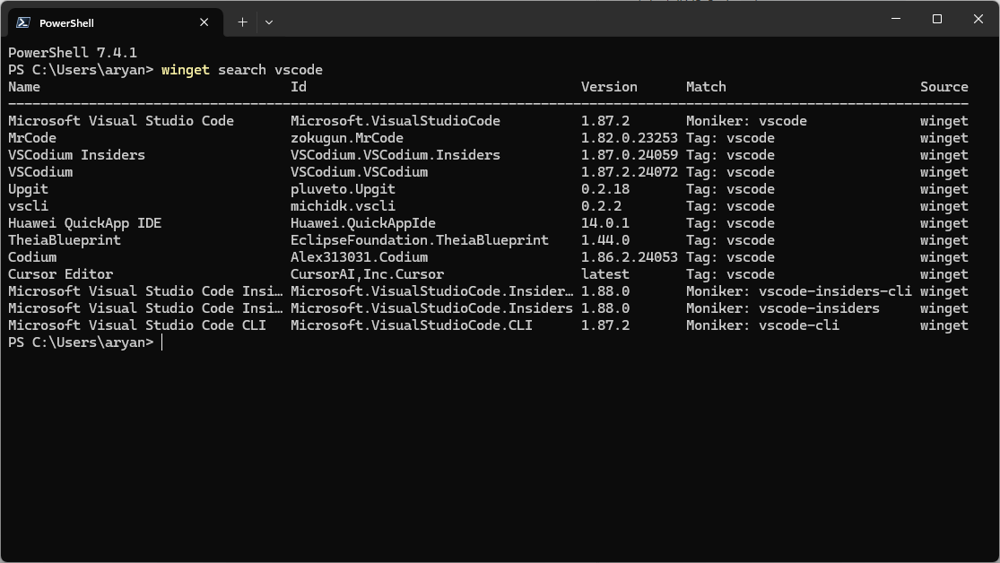

2. Install VS Code using the `winget` utility.

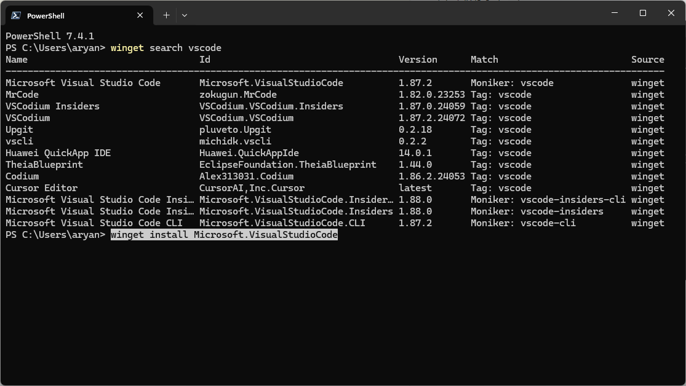

3. Search for the official `nvm` repository for Windows.

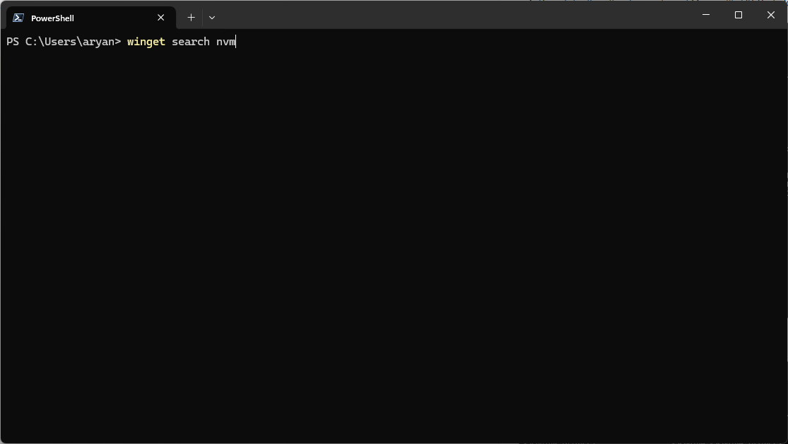

4. This is the result

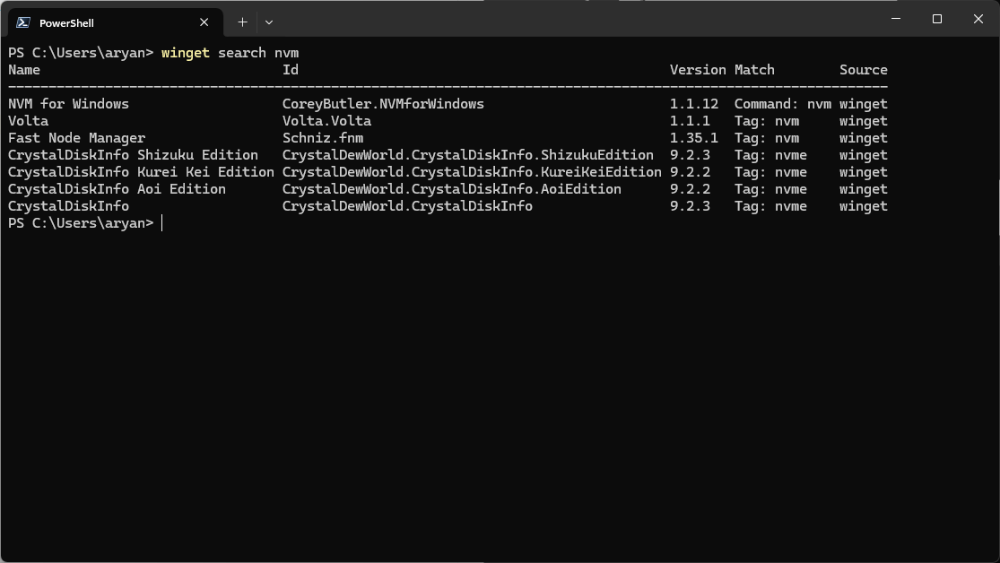

5. Install Corey Butler's NVM for Windows package.

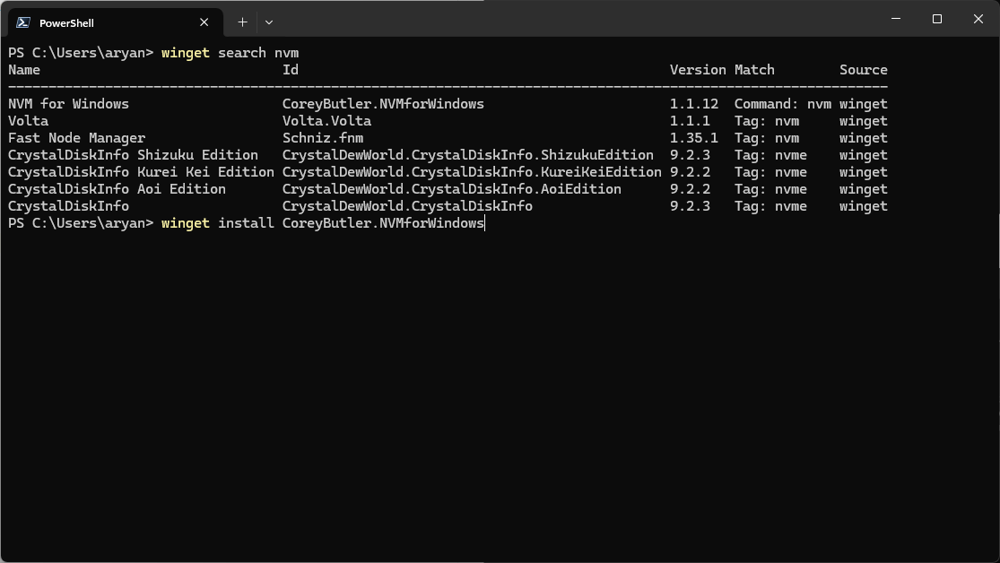

6. Find the latest LTS version of nvm

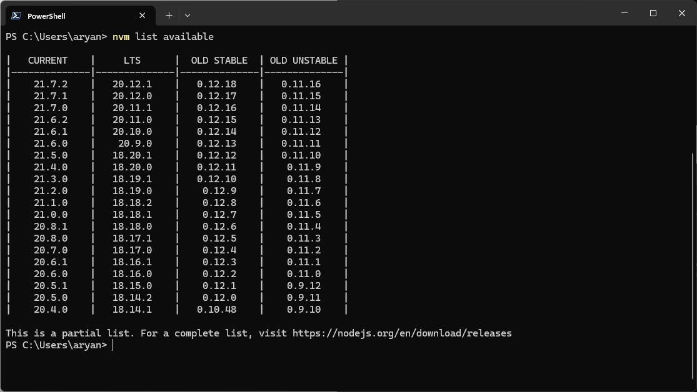

7. Install the latest LTS version

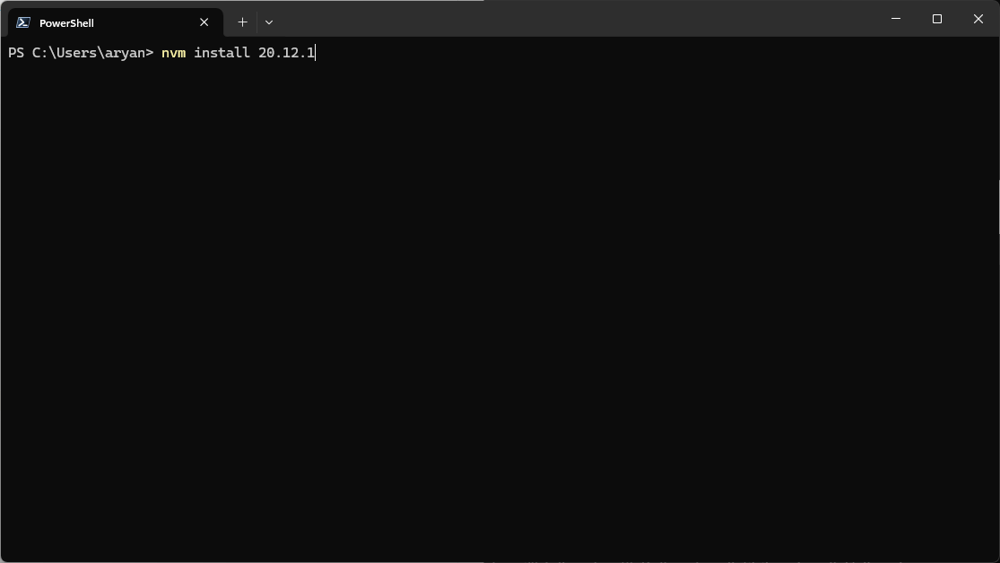

8. Set the latest installation as the current.

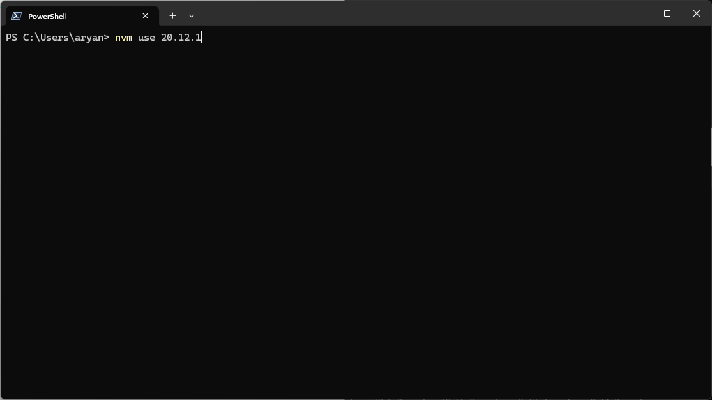

9. Create a new JavaScript project using vite

10. Write the name of the project and select Vanilla 

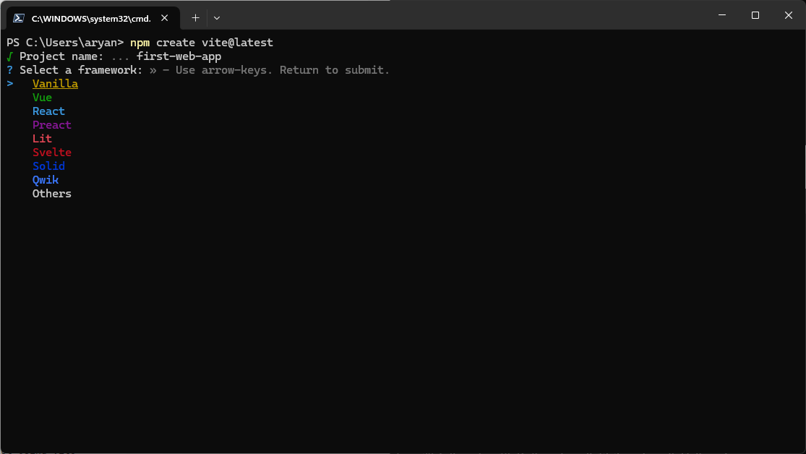

11. Select JavaScript

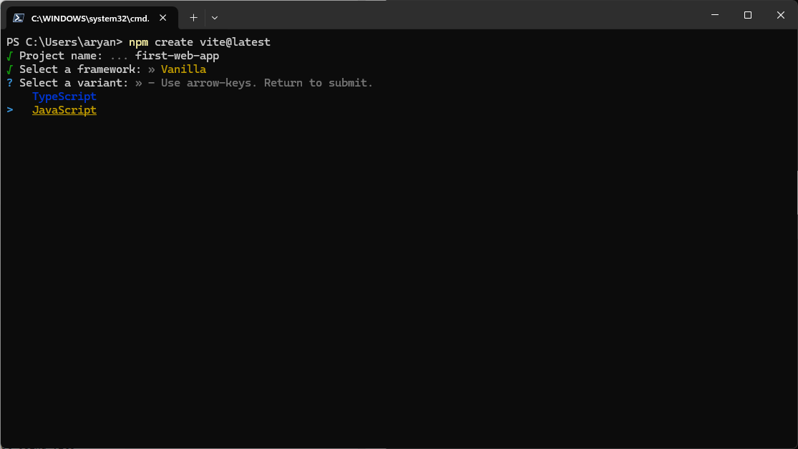

12. Now run the given commands in order

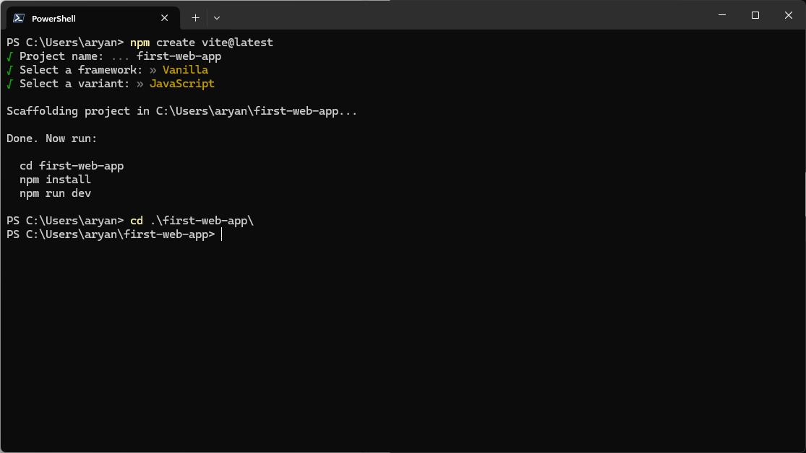

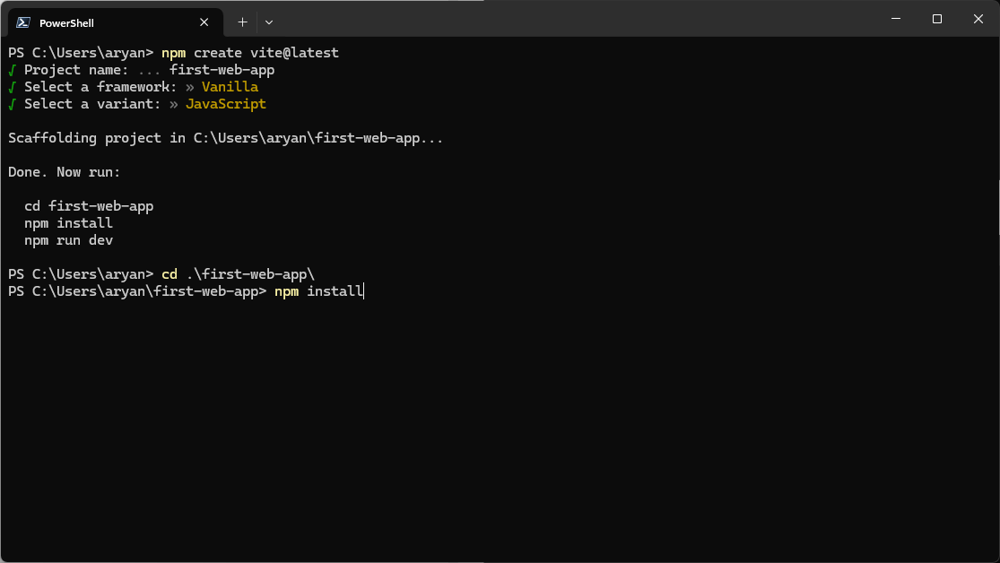

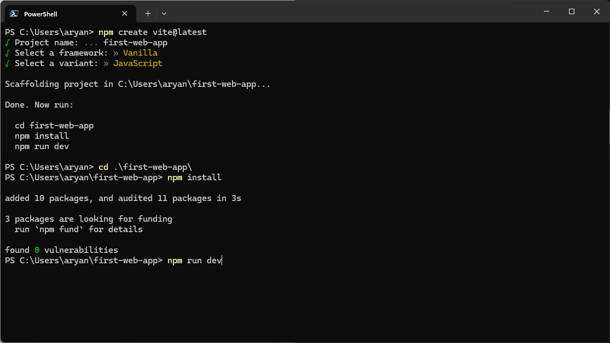

13. Now the application will start running in a Vite server like this

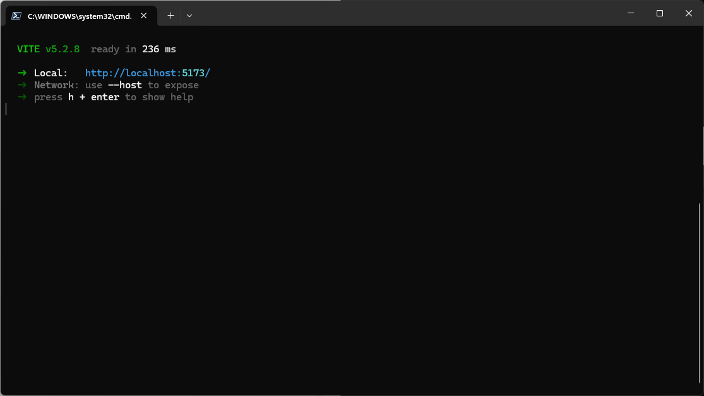

14. Press `ctrl + c` to stop the server, and press y and then enter

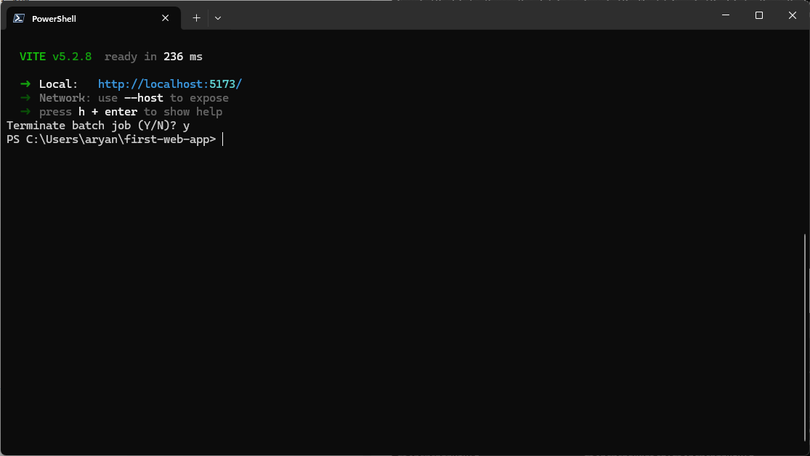

15. Use command `code .` to open a VS Code window for the same project.

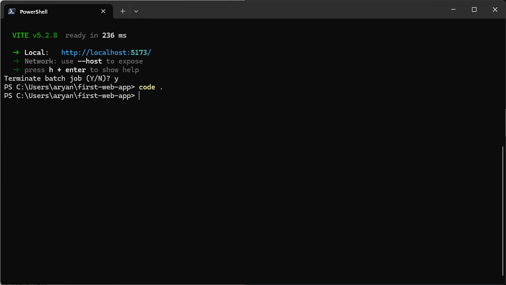